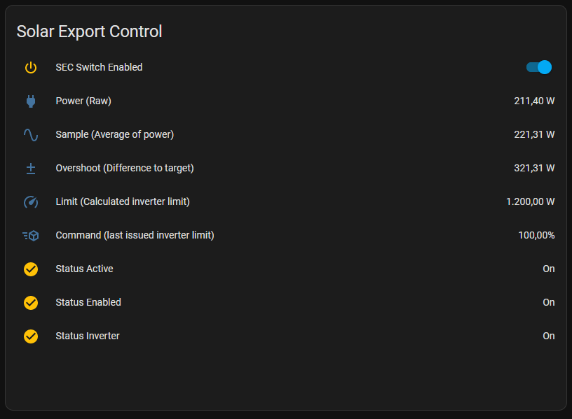

# SolarExportControl

## Disclaimer: Looking for testers and feedback

This application was tested multiple days on my setup. Further tests on other setups are necessary!

## V 2: Now with home assistant integration

## Description

This application takes your current electric power consumption (from a digital electric meter for example) and compares it to a defined target value.

If your consumption is greater than your target: Lower the limit of your solar inverter

If your consumption is lower than your target: Increase the limit on your solar inverter

## Original setup

- Power reading via esp32 with tasmota and a 'hichi' IR sensor into mqtt broker
- Limiting power of inverter with an esp32 running [OpenDTU](https://github.com/tbnobody/OpenDTU) and receiving the limit over mqtt

## Implemented Features

- Configurable command behaviour:
  - Min limit
  - Relative (%) or absolute (W)
  - Throttle amount of commands
  - Minimum difference to last command (hysteresis)
- Configurable power reading:
  - Offset
  - Smoothing: Average over X samples
- Listen to inverter status: Turn off limit calculation when your inverter does not produce
- Turn on / off via mqtt
- Home Assistant integration
- Scriptable generic limit callback: Send your inverter limit anywhere!

## Demo

An ongoing graph/config screenshot collection can be found [here](docs/Demo.md)

## Requirements

- MQTT Broker
- A power reading sensor:
  - Publishes to MQTT Broker
  - The published value **must** include the inverter power
  - The published value **must** be negative if power is exported (inverter production greater than consumption)
  - Should publish at least every 10 seconds

- An inverter which can regulate its power production
  - Receive its power limit from the MQTT Broker
  - Power limit can be watts or percentage

- Python3 (min. 3.10)

## How to install

1. Fullfill [Requirements](#requirements)
2. Clone or download Repo
3. Open a terminal (CMD, Powershell, Bash etc.) in the project root directory
4. Install requirements. Execute:
   > `pip install -r requirements.txt`
5. Create a basic config. Execute:
   > `python .\src\main.py .\src\config\config.json --wizard`
6. Answer the questions. Use the created config file whenver a `config.json` is passed.
7. Optional: Further modify [config](#config) to your liking
8. Modify [customize](#customize) to match your devices
9. [Run](#how-to-run)

## Config

Edit the `.\src\config\config.json` to match your environment: [Docs](/docs/Config.md)

Alternative: Use the `--wizard` argument to get guided through config creation

## Customize

You must at least check 2 things:

**1. What data is my power meter sending?**

This application needs the value as a number, but your power meter may publish json or an other arbitrary payload. You must edit the `parse_power_payload` function to convert the payload to a number. See ['parse_power_payload'](./docs/Customize.md#required-parse_power_payload) for examples.

**2. How should the calculated limit be formated before publishing it?**

Maybe your inverter wants the new limit as json? For most people it will be as easy as rounding to 2 decimal places. You must edit the `command_to_payload` function to convert the new limit command to your desired payload. See ['command_to_payload '](./docs/Customize.md#required-command_to_payload)

## How to run

- Run normal: `python .\src\main.py .\src\config\config.json`
- Run with VSCode ("launch.json" should be included)

### Arguments

- Entrypoint: `/src/main.py`
- Required (positional) argument:
  - `(path to config.json)`: can be relative or absolute
- Optional arguments:
  - `--verbose` : detailed logging
  - `--mqttdiag`: additional mqtt diagnostics
  - `--wizard`: interactive wizard for creating a basic config file

## MQTT Topics

See [Docs](/docs/Mqtt.md)

## Docker support

See [Docs](/docs/Docker.md)

## Config suggestions

For `config.command.hysteresis` I would suggest about 1-3% of your `command.maxPower`

If your power reading interval is less than or around 10 seconds:

- `config.command.throttle: 10`
- `config.reading.smoothing: "avg"`
- `config.reading.smoothingSampleSize:8`

If your power reading interval is slower you are free to turn especially `config.command.throttle` to `0`.

If your power reading interval is very slow (1 minute or greater) you should also turn `config.reading.smoothing` to `none`

However this basically will change the inverter power limit every interval since every power reading is different.
