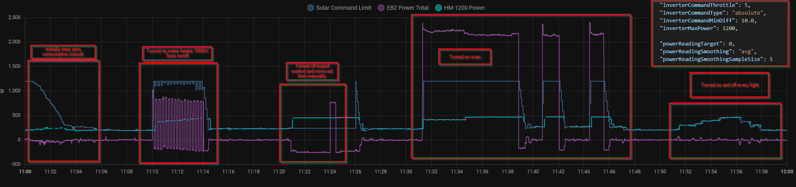

# Demo 1

> Attention!: Config is outdated!

- "Solar Command Limit" is the transmitted limit
- "EBZ Power Total" is my electric meter (interval 1s)
- "HM-1200" is my inverter

> Findings: OpenDTU can sometime fail to successfully set the limit (see ca. 11:35). If this value is the min or max, it wont be retransmitted because of `config.command.minDiff`. Introducing a "force" retransmit parameter.

